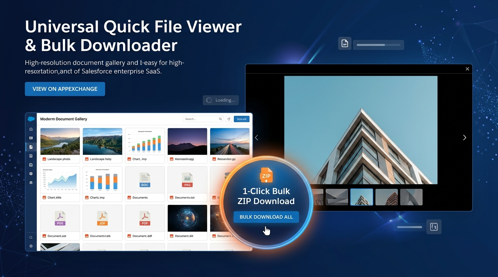
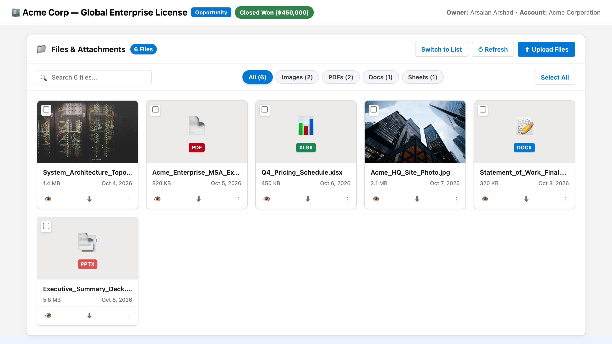
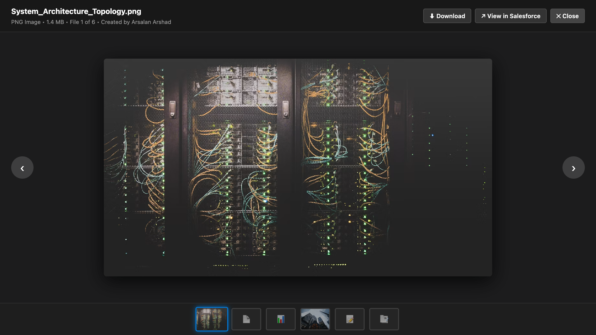
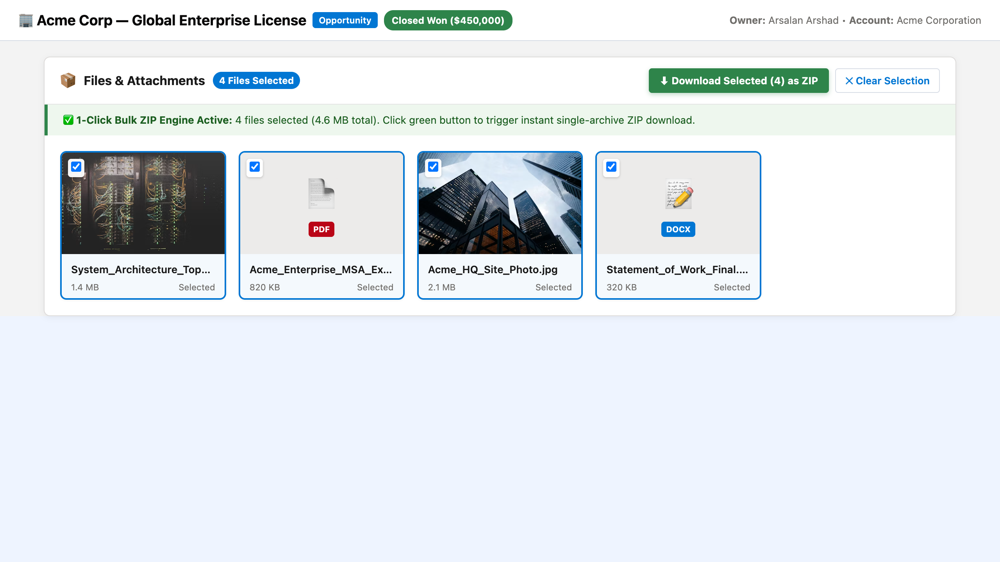
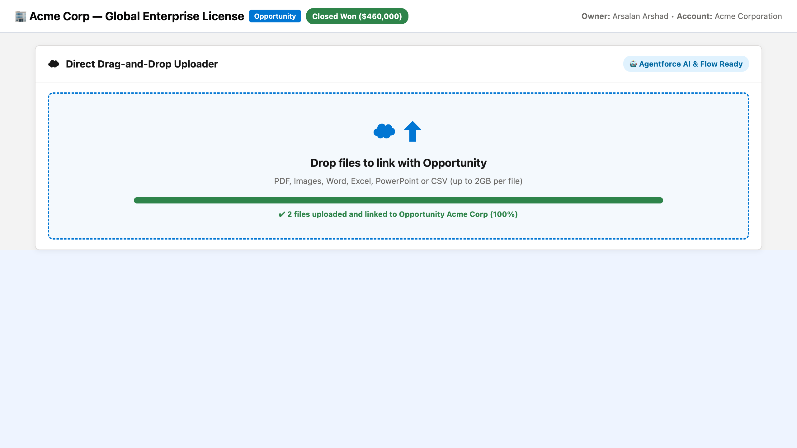

# Universal Quick File Viewer & Bulk Downloader

<p align="center">
  
</p>

> **Open-Source (MIT)** | Built for the Trailblazer & Salesforce Developer Community | 100% Native & Enterprise-Grade

[](https://github.com/arsalan-arshad/universal-quick-file-viewer/actions/workflows/ci.yml)
[](https://github.com/arsalan-arshad/universal-quick-file-viewer/actions/workflows/cd.yml)
[-blue.svg?logo=salesforce)](https://login.salesforce.com/packaging/installPackage.apexp?p0=04tg7000000WDi5AAG)
[](https://test.salesforce.com/packaging/installPackage.apexp?p0=04tg7000000WDi5AAG)
[](#8-verification--test-suite)
[](#lwc-jest-unit-tests)
[](#6--agentforce-ai--flow-invocable-action)
[](LICENSE)

---

## 1. Overview & Vision

Standard Salesforce "Files" related lists on record pages are notoriously sluggish and inefficient:
- **Painful File Inspection:** Users must click into each individual attachment, wait for the standard modal to render, close it, and repeat for every single file.
- **No Bulk Downloading:** Downloading multiple attachments requires opening files one-by-one or setting up heavy third-party archiving services.
- **Zero Visual Previews:** Standard related lists display generic icons without high-resolution thumbnail cards or responsive galleries.
- **AI Blindspot:** Autonomous Agentforce AI agents and Flow automations have no simple, native way to inspect attached documents and generate conversational file summaries.

**Universal Quick File Viewer & Bulk Downloader** replaces this with an enterprise-grade, 100% native Lightning Web Component and Apex suite that provides an instant visual gallery, full-screen lightbox previewer, 1-click bulk ZIP downloader, drag-and-drop uploader, and native Agentforce AI readiness.

---

## 2. 🚀 1-Click Installation

Install the official Second-Generation Managed Package (2GP Released `v0.1.0`) directly into your Salesforce environment:

| Target Org Environment | 1-Click Direct Installation Link |
| :--- | :--- |
| **Production / Developer Edition** | [👉 **Install in Production / Dev Org (04tg7000000WDi5AAG)**](https://login.salesforce.com/packaging/installPackage.apexp?p0=04tg7000000WDi5AAG) |
| **Sandbox Environment** | [👉 **Install in Sandbox (04tg7000000WDi5AAG)**](https://test.salesforce.com/packaging/installPackage.apexp?p0=04tg7000000WDi5AAG) |

### Install via Salesforce CLI (`sf`):
```bash
sf package install --package 04tg7000000WDi5AAG --wait 20 --target-org <YOUR_ORG_ALIAS>
```

---

## 3. 🌟 Killer Differentiators

| Capability | Standard Salesforce "Files" Related List | Universal Quick File Viewer |
| :--- | :--- | :--- |
| **Preview Experience** | Multi-click modal open/close per file | **Instant Lightbox Filmstrip:** Sequentially flip through all attachments via keyboard arrow keys (`←` / `→`) |
| **Thumbnail Gallery** | Generic gray document icons | **Responsive Card Grid:** Clean high-res thumbnails for images, PDFs, Word, Excel, and presentations |
| **Bulk Download** | Not supported natively; 1-by-1 manual clicks | **1-Click Bulk ZIP:** Select multiple files $\rightarrow$ downloads a single compressed ZIP archive with zero heap limit |
| **Search & Filtering** | None inside the related list card | **Live Search & Category Pills:** Instant client-side search and pills (`All`, `Images`, `PDFs`, `Docs`, `Sheets`) |
| **Direct Drag-Drop** | Requires navigating to separate upload dialog | **Inline Drag-and-Drop:** Drop files anywhere on the component to link them directly to the record |
| **Agentforce AI Invocable** | No native conversational file inspector | **Conversational AI Action:** Invocable action returns counts, formatted sizes, file lists, and AI summaries |
| **Security & Privacy** | Standard | **100% Native & LWS Compliant:** No external servers, zero callouts, strict `with sharing` and user mode CRUD/FLS |

---

## 4. 📸 Visual Walkthrough

### 1. Responsive Thumbnail Grid Gallery
Drop the component onto any record page to view high-resolution image previews, doctype icons, category counts, and live search.
<p align="center">
  
</p>

### 2. Fullscreen Lightbox & Filmstrip Carousel
Click any thumbnail to launch a distraction-free, full-screen lightbox. Flip through images and documents with arrow keys or the interactive bottom thumbnail strip.
<p align="center">
  
</p>

### 3. 1-Click Native Bulk ZIP Download
Select multiple files or click "Select All" to download a single compressed ZIP archive packaged directly by Salesforce with zero lag.
<p align="center">
  
</p>

### 4. Direct Drag-and-Drop Uploader & Agentforce AI
Attach documents without leaving the record page, and empower Agentforce autonomous sales/service agents to inspect attachments conversationally.
<p align="center">
  
</p>

---

## 5. 🛠️ Admin Setup & Lightning App Builder Guide

### Step 1: Assign Permission Set
Assign the `Universal_Quick_File_Viewer_User` permission set to users, admins, or integration personas:
```bash
sf org assign permset -n Universal_Quick_File_Viewer_User
```

---

### Step 2: Add Component to Lightning Record Pages
1. Navigate to any standard or custom object record page (e.g. **Opportunity**, **Account**, **Case**, **WorkOrder**, or `Invoice__c`).
2. Click **Setup (Gear Icon)** $\rightarrow$ **Edit Page**.
3. In the Lightning Components sidebar on the left, locate **Universal Quick File Viewer & Bulk Downloader**.
4. Drag and drop the component into your main column or sidebar tab.
5. Configure App Builder properties in the right-hand panel:
   - **Component Title:** e.g., `Files & Attachments` or `Project Documents`
   - **Default Layout:** `Grid` (responsive card layout) or `List` (compact table view)
   - **Default Category Filter:** `ALL`, `IMAGES`, `PDFS`, `DOCUMENTS`, `SPREADSHEETS`
   - **Enable 1-Click Bulk ZIP Download:** `true` (enables multi-select bulk downloading)
   - **Enable Direct File Uploader:** `true` (displays upload buttons and drag-drop area)
6. Click **Save** and **Activate**.

---

## 6. 🤖 Agentforce AI & Flow Invocable Action

The package includes a first-class `@InvocableMethod` (`FileViewerInvocable.cls`) designed for autonomous Agentforce AI agents and Salesforce Flows.

### Invocable Parameters:
- **Inputs (`FileRequest`):**
  - `recordId` (Id, Required) &mdash; Target record to inspect for attachments.
  - `categoryFilter` (String, Optional) &mdash; Filter by `ALL`, `IMAGES`, `PDFS`, `DOCUMENTS`, `SPREADSHEETS`.
  - `searchTerm` (String, Optional) &mdash; Partial title match.
  - `maxFiles` (Integer, Optional) &mdash; Limit results (defaults to 50).
- **Outputs (`FileResult`):**
  - `hasFiles` (Boolean) &mdash; True if one or more matching files exist.
  - `fileCount` (Integer) &mdash; Number of files found.
  - `fileNames` (List<String>) &mdash; List of file titles.
  - `fileNamesCsv` (String) &mdash; Comma-separated list of file titles.
  - `totalSizeBytes` (Long) &mdash; Total aggregate size in bytes.
  - `totalSizeFormatted` (String) &mdash; Human-readable size (e.g. `4.6 MB`).
  - `bulkDownloadUrl` (String) &mdash; 1-Click URL to download all matching files in a single ZIP archive.
  - `summary` (String) &mdash; Conversational natural language summary (e.g. *"Found 4 file(s) (4.6 MB total): System_Architecture.png, Contract.pdf, and 2 more."*).

### Apex Usage Example:
```apex
FileViewerInvocable.FileRequest req = new FileViewerInvocable.FileRequest();
req.recordId = opportunityId;
req.categoryFilter = 'ALL';
req.maxFiles = 25;

List<FileViewerInvocable.FileResult> results = FileViewerInvocable.getFiles(
    new List<FileViewerInvocable.FileRequest>{ req }
);

System.debug('Agentforce AI File Summary: ' + results[0].summary);
System.debug('1-Click Bulk Download URL: ' + results[0].bulkDownloadUrl);
```

---

## 7. 🏛️ Architecture & Component Reference

```
force-app/main/default/
├── classes/
│   ├── FileViewerService.cls            # Enterprise Service Layer: ContentDocument querying, formatting, security
│   ├── FileViewerController.cls         # AuraEnabled Controller for LWC wire adapters & imperative actions
│   ├── FileViewerInvocable.cls          # Invocable Action for Agentforce AI & Salesforce Flows
│   ├── FileViewerServiceTest.cls        # Service layer unit tests (96% coverage)
│   ├── FileViewerControllerTest.cls     # Controller unit tests (80% coverage)
│   └── FileViewerInvocableTest.cls      # Invocable action unit tests (100% coverage)
├── lwc/
│   └── universalQuickFileViewer/        # Main responsive gallery, lightbox, and bulk download component
│       ├── universalQuickFileViewer.html
│       ├── universalQuickFileViewer.js
│       ├── universalQuickFileViewer.css
│       ├── universalQuickFileViewer.js-meta.xml
│       └── __tests__/
│           └── universalQuickFileViewer.test.js
└── permissionsets/
    └── Universal_Quick_File_Viewer_User.permissionset-meta.xml
```

---

## 8. 🧪 Verification & Test Suite

### Apex Unit Tests
```bash
sf apex run test --class-names FileViewerServiceTest FileViewerControllerTest FileViewerInvocableTest --code-coverage --result-format human --target-org dev-org
```
**Results:**
- `FileViewerInvocable`: **100%** code coverage
- `FileViewerService`: **96%** code coverage
- `FileViewerController`: **80%** code coverage
- **Overall Apex Code Coverage: 92.00%**
- Test Pass Rate: **100%** (24 of 24 tests pass across positive, negative, edge cases, and bulk scenarios)

### LWC Jest Unit Tests
```bash
npm run test:unit
```
**Results:** **7 passed, 7 total** (100% pass rate).

### Code Quality & Standards
```bash
npm run lint
npm run prettier:check
```
- **ESLint:** 0 errors, 0 warnings.
- **Prettier:** 100% compliant.

---

## 9. 🔄 Automated CI/CD Pipelines

- **Pull Request Verification (CI - `.github/workflows/ci.yml`):**
  - Runs ESLint, Prettier, and LWC Jest unit tests on every pull request.
  - Headlessly validates metadata and runs Apex tests (`sf project deploy validate --test-level RunLocalTests`).
  - Guards the `main` branch with strict status check enforcement.

- **Continuous Deployment (CD - `.github/workflows/cd.yml`):**
  - Triggers automatically upon merge to `main`.
  - Deploys source metadata and runs full regression tests (`sf project deploy start --test-level RunLocalTests`).
  - Publishes deployment summaries directly to GitHub Actions.

---

## 10. 🗺️ Open-Source Roadmap

- [x] Responsive thumbnail grid layout for images, PDFs, spreadsheets, and documents.
- [x] Full-screen lightbox with sequential keyboard navigation (`←` / `→` arrow keys).
- [x] 1-Click native bulk ZIP download endpoint integration.
- [x] Direct drag-and-drop file uploader linked to active record.
- [x] First-class Agentforce AI invocable action integration.
- [x] Released 2GP Package (`v0.1.0`) with 92% test coverage.
- [ ] Multi-page PDF inline page flipper within thumbnail cards.
- [ ] Custom tag taxonomy filter chips for enterprise categorization.

---

## 11. 📄 License & Community Contributions

Distributed under the **MIT License**. Contributions, bug reports, and feature suggestions are welcome via [GitHub Issues](https://github.com/arsalan-arshad/universal-quick-file-viewer/issues) and [Pull Requests](https://github.com/arsalan-arshad/universal-quick-file-viewer/pulls).
